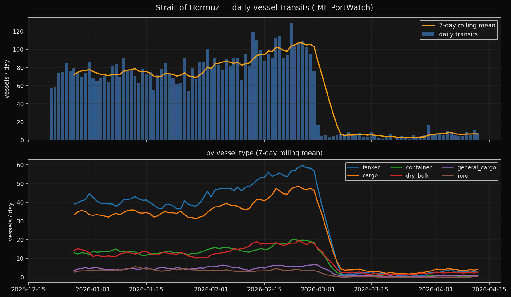
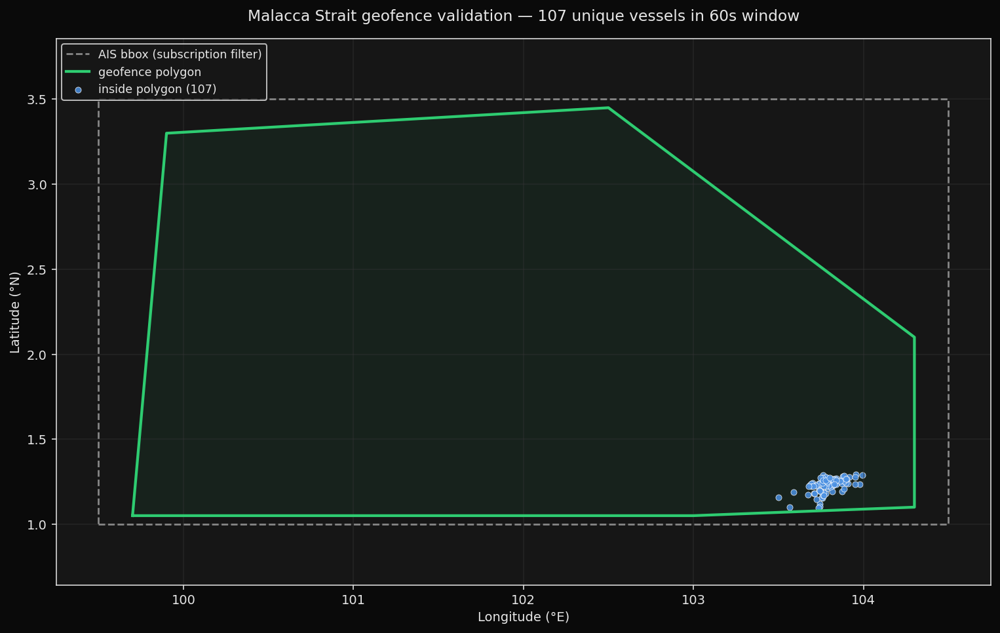

# tanktrack

Real-time vessel geofence monitor with AIS + anchor detection. Current target: **Strait of Hormuz** — one of the world's busiest oil chokepoints.

Pure Python + SQLite. No Docker, no server dependencies beyond a free AIS feed.

Counters exposed:
- **In transit now** — vessels currently inside the strait polygon
- **Entered / Exited** (rolling 1h and 24h windows)
- **Anchored** — vessels sitting inside the polygon with SOG below a configurable threshold for a configurable duration
- **By vessel type** (tanker / cargo / passenger / fishing / etc.)
- **Exit direction** — classifies outbound crossings as north / south / east / west relative to polygon centroid

Historical baseline from **IMF PortWatch** — free, no auth — for anomaly detection.

## Validated

Two independent validations (see `results/VALIDATION.md`):

1. **120-day PortWatch backfill** of Strait of Hormuz daily transits — establishes ground truth and reveals a 94% drop in activity in early March 2026.
2. **60-second live AIS test** against the Malacca Strait (currently ~200 transits/day) — 107 unique vessels all correctly classified by the geofence.




---

## Quick start

```bash
cd ~/tanktrack
uv sync

# 1. Free AIS key (email-only, ~60 seconds): https://aisstream.io/authenticate
cp .env.example .env
# Edit .env, paste your key into AISSTREAM_API_KEY=

# 2. Initialize the SQLite file + schema
tanktrack init-db

# 3. Start the live AIS consumer (long-running; run under tmux or systemd)
tanktrack stream

# 4. In a second shell, inspect state
tanktrack state
tanktrack transitions --limit 20

# 5. Serve the JSON API (optional)
tanktrack serve
curl http://127.0.0.1:8088/state | jq
```

No Docker, no Postgres. Data lives in `tanktrack.db` at the repo root (gitignored).

---

## Architecture

```
AISstream.io WebSocket  ────►  vessel_state.py  ────►  SQLite (tanktrack.db)
 (filtered to Hormuz                  │                        │
  bounding box)                       │                        ▼
                                      │                ┌──────────────┐
                                      │                │ vessels      │
                                      │                │ vessel_state │
                                      │                │ transitions  │
                                      │                └──────────────┘
                                      ▼                        │
                                geofence.py                    ▼
                         (point-in-polygon tests)       FastAPI /state
                                                        /inside
                                                        /transitions
                                                        /baseline
                                                              ▲
                                  IMF PortWatch ──────────────┘
                                  (daily aggregate,
                                   via ArcGIS feature service)
```

---

## State machine (per vessel)

```
                  crossed in
      OUTSIDE  ─────────────►  INSIDE (in_transit)
         ▲                           │  │
         │      crossed out          │  │  SOG < 0.5kt for ≥ 15 min
         └───────────────────────────┘  ▼
                                      ANCHORED
                                         │
                                         │  SOG ≥ 0.5kt
                                         ▼
                                      INSIDE (in_transit)
```

Emits `entered`, `exited`, `anchored`, `resumed` rows to the `transitions` table. Thresholds are env-tunable (`ANCHOR_SOG_KT`, `ANCHOR_MIN_MINUTES`).

---

## How this was built — methodology

Eight layers, each verified before the next was added.

**1. Geofence polygon** — `src/tanktrack/geofence.py`

Six-vertex quadrilateral covering the navigable strait between Qeshm Island (Iran) and the Musandam Peninsula (Oman). Narrowest point is ~21 nautical miles. Bounding box sent to AISstream is slightly looser than the polygon (so we don't miss edge messages); the polygon is the real geofence applied locally via Shapely `contains()`. Exit direction classifier uses the polygon centroid to distinguish north/south/east/west crossings.

Smoke tests in `tests/test_geofence.py` assert expected inside/outside classification on known points.

**2. SQLite persistence** — `src/tanktrack/db.py` + `schema.sql`

Three tables:
- `vessels` — per-MMSI static metadata (name, type, IMO, destination, dimensions)
- `vessel_state` — latest observed position + `inside`/`anchored` booleans (one row per vessel)
- `transitions` — append-only log of discrete `entered`/`exited`/`anchored`/`resumed` events (UUID id)

All timestamps are ISO-8601 UTC strings. Booleans stored as INTEGER 0/1. WAL journal mode enabled so the AIS stream writer and multiple readers (CLI, API, validation scripts) can share the file without blocking each other.

**3. Per-vessel state machine** — `src/tanktrack/vessel_state.py`

`process_position(Position)` is the core function. On every AIS update it:
- Reads previous `(inside, anchored, stopped_since)` from `vessel_state`
- Computes the new state using the geofence test + anchor threshold
- Emits appropriate transition rows: `entered` on outside→inside, `exited` on inside→outside (with direction), `anchored` when SOG stays <0.5kt for 15 min, `resumed` when motion restarts
- Upserts the new `vessel_state` row

All transitions are atomic — a single SQLite transaction per AIS message.

**4. AIS consumer** — `src/tanktrack/ais_stream.py`

WebSocket client for AISstream.io with exponential-backoff reconnect. Subscribes with the Hormuz bounding box so we only receive relevant messages. Handles two AIS message families:
- `PositionReport` (AIS types 1/2/3/18/19): lat, lon, SOG, COG, MMSI → `process_position()`
- `ShipStaticData` / `StaticDataReport` (AIS types 5/24): name, vessel type, IMO, dimensions, destination → `upsert_vessel_meta()`

Ship-type integer codes are collapsed into human categories (`tanker`, `cargo`, `container`, `passenger`, `fishing`, etc.) for readable breakdowns.

**5. Read-side queries** — `src/tanktrack/counters.py`

Lightweight SQL helpers:
- `count_inside()` / `count_anchored()` — instantaneous state
- `counts_window(hours)` — rolling window aggregation over `transitions`
- `by_vessel_type_inside()` — grouped breakdown for the current `inside` set
- `current_inside()` / `recent_transitions()` — detail listings

**6. Historical baseline** — `src/tanktrack/portwatch.py`

Thin async client for the IMF PortWatch ArcGIS Feature Service (`Daily_Chokepoints_Data`). Free, no auth, updated weekly. Used for 7d / 30d moving averages and 4-month backfill validation.

**7. API surface** — `src/tanktrack/api.py` + `src/tanktrack/cli.py`

- CLI via Typer: `tanktrack init-db | stream | state | transitions | serve | db-check`
- HTTP API via FastAPI on port 8088 by default

**8. Validation artifacts** — `scripts/`

- `backfill_portwatch.py` — pull N days of Hormuz aggregate data, write CSV + PNG, summarize
- `save_malacca_validation.py` — run the geofence logic against Malacca Strait for a fixed window, write JSON + PNG showing vessel positions classified inside/outside
- `test_live_malacca.py` — in-memory Malacca test that exercises the full state-machine flow without touching the production DB

---

## API endpoints

| Path | Returns |
|---|---|
| `GET /` | service info + endpoint list |
| `GET /state` | headline counters: in_transit_now, anchored_now, 24h and 1h windows, by vessel type |
| `GET /inside` | full list of vessels inside the polygon right now |
| `GET /transitions?limit=50` | most recent entered/exited/anchored/resumed events |
| `GET /baseline` | IMF PortWatch 7d / 30d average daily transits |

---

## Data sources

- **AISstream.io** — real-time WebSocket feed of decoded AIS position + static-data messages. Free with registration.
- **IMF PortWatch** — daily aggregate chokepoint transits via ArcGIS Feature Service. Free, no auth. Updated weekly (Tuesdays).

---

## Tuning

- **Polygon shape** — edit `HORMUZ_POLYGON_LATLON` in `geofence.py`. No restart needed; next AIS message re-evaluates.
- **Anchor threshold** — `ANCHOR_SOG_KT` (default 0.5 kts) + `ANCHOR_MIN_MINUTES` (default 15).
- **AIS filter** — by default subscribes to `PositionReport` + `ShipStaticData`. Add more types in `ais_stream.py` if needed.
- **DB location** — `TANKTRACK_DB_PATH` env var; defaults to `./tanktrack.db`.

---

## Extending to other chokepoints

The `geofence.py` module currently defines constants for Hormuz. To add Malacca / Bosphorus / Bab el-Mandeb / etc.:

1. Add a new polygon + bbox constant in `geofence.py`
2. Select which region the stream subscribes to via an env var (e.g. `TANKTRACK_REGION=malacca`)
3. Switch the DB path per region if you want them isolated

Hormuz is the V1 target because of its macro-financial relevance (oil flow). The architecture is region-agnostic.

---

## Known gaps (V1)

- **No gap detection for stale vessels.** If a vessel's AIS goes dark inside the polygon, it stays flagged as inside until the next position report or a manual expiry. Would want a "last seen more than N minutes ago → mark unknown" sweeper.
- **Raw SOG, no smoothing.** Occasional spurious sub-0.5-kt readings from moving ships can false-trigger anchor detection until the `MIN_MINUTES` threshold elapses. A rolling-window SOG average would harden this.
- **No entry-direction tracking** — only exit direction is classified today.
- **No vessel-class-specific polygons** — e.g. shipping-lane vs anchorage areas are treated identically.
- **No terrestrial AIS redundancy.** AISstream.io is the single source; a second source (Spire, exactEarth, local receiver) would be the obvious production hardening.

---

## Reproduce the validations

```bash
# 120-day Hormuz baseline from IMF PortWatch
python scripts/backfill_portwatch.py --days 120
# → results/portwatch_strait_of_hormuz_120d.csv + .png

# 60-second live geofence test against Malacca Strait
python scripts/save_malacca_validation.py 60
# → results/malacca_validation.json + .png

# In-memory state-machine test (no DB writes)
python scripts/test_live_malacca.py 60
```

---

## License

MIT.
